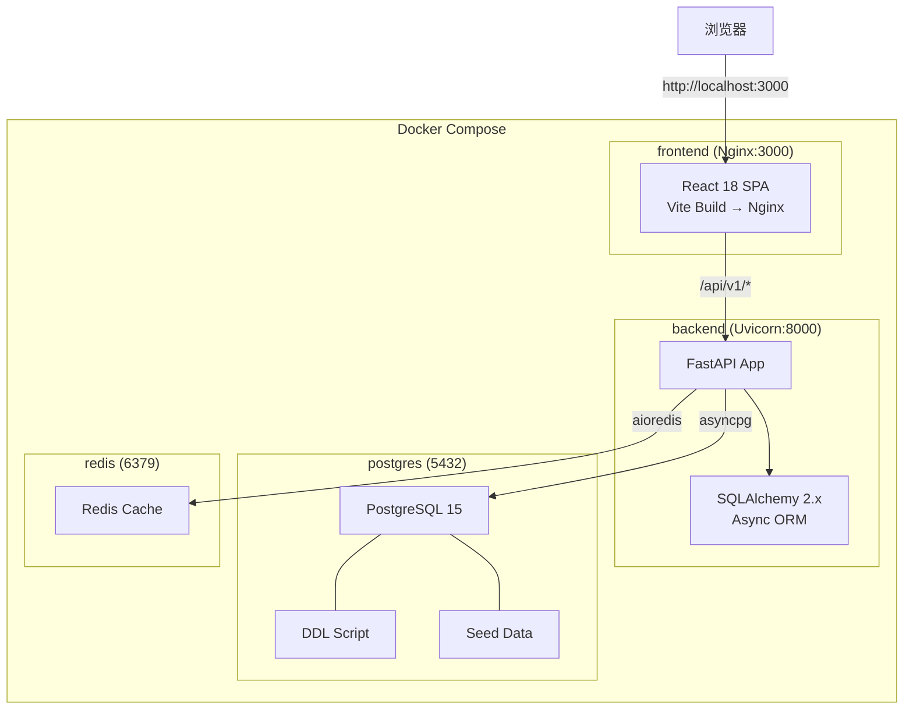
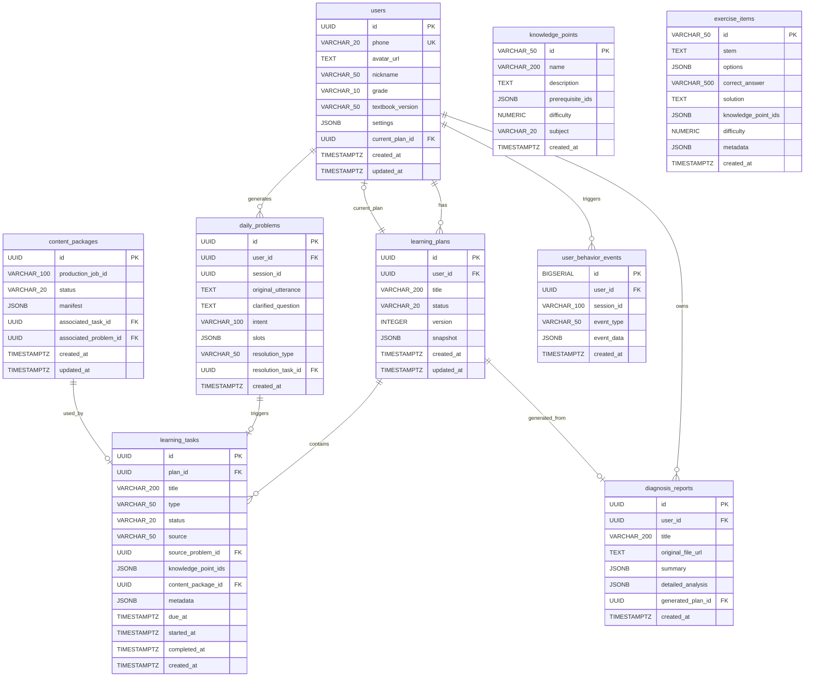

# 设计文档：艾乐学伴 MVP Day 1 — 项目初始化与基础设施落地

## 概述

本设计文档定义艾乐学伴 MVP Demo Day 1 的完整技术实现方案。Day 1 的核心目标是搭建可端到端运行的项目骨架，包括：

- **Monorepo 项目结构**：统一管理前端、后端、数据库脚本
- **Docker Compose 编排**：一键启动 PostgreSQL、Redis、FastAPI 后端、React 前端
- **数据库初始化**：DDL 建表 + 种子数据自动填充
- **后端 FastAPI 骨架**：ORM 模型、数据库连接、健康检查接口
- **前端 React 骨架**：路由、API 客户端、基础布局、状态管理

交付标准：`docker-compose up --build` 后，前端页面可访问（localhost:3000），后端健康检查返回 200（localhost:8000/health），数据库包含完整种子数据。

### 技术选型

| 层级 | 技术栈 | 版本 |
|------|--------|------|
| 前端框架 | React + TypeScript | 18.x + 5.x |
| 前端构建 | Vite | 5.x |
| CSS 方案 | Tailwind CSS | 3.x |
| 状态管理 | Zustand | 4.x |
| 路由 | react-router-dom | 6.x |
| HTTP 客户端 | axios | 1.x |
| 后端框架 | FastAPI | 0.110+ |
| ORM | SQLAlchemy 2.x (async + asyncpg) | 2.x |
| 缓存 | Redis | latest |
| 数据库 | PostgreSQL | 15 |
| 认证 | JWT (python-jose) | - |
| 容器编排 | Docker Compose | v2 |

## 架构

### 系统架构图



### 服务依赖关系

```
frontend → backend → postgres, redis
```

- `postgres` 和 `redis` 无依赖，最先启动
- `backend` 依赖 `postgres` 和 `redis`
- `frontend` 依赖 `backend`

### Monorepo 目录结构

```
aile-mvp/
├── docker-compose.yml          # 容器编排配置
├── .gitignore                  # Git 忽略规则
├── README.md                   # 项目说明文档
├── database/
│   ├── 01_ddl.sql              # 建表脚本（表、索引、外键、触发器、视图）
│   └── 02_seed.sql             # 种子数据脚本
├── backend/
│   ├── Dockerfile
│   ├── requirements.txt
│   └── app/
│       ├── main.py             # FastAPI 入口 + CORS + 健康检查
│       ├── config.py           # 环境变量配置
│       ├── db/
│       │   ├── __init__.py
│       │   ├── session.py      # SQLAlchemy async session 工厂
│       │   └── base.py         # Declarative Base
│       ├── models/
│       │   ├── __init__.py
│       │   ├── user.py
│       │   ├── learning_plan.py
│       │   ├── learning_task.py
│       │   ├── daily_problem.py
│       │   ├── content_package.py
│       │   ├── knowledge_point.py
│       │   ├── exercise_item.py
│       │   ├── diagnosis_report.py
│       │   └── user_behavior_event.py
│       ├── schemas/            # Pydantic 模型（Day 1 仅骨架）
│       │   └── __init__.py
│       ├── repositories/       # 数据访问层（Day 1 仅骨架）
│       │   └── __init__.py
│       ├── services/           # 业务逻辑层（Day 1 仅骨架）
│       │   └── __init__.py
│       ├── api/                # 路由（Day 1 仅健康检查）
│       │   ├── __init__.py
│       │   └── health.py
│       └── middlewares/        # 中间件（Day 1 仅 CORS）
│           └── __init__.py
└── frontend/
    ├── Dockerfile
    ├── nginx.conf              # Nginx 配置（反向代理 /api/v1）
    ├── package.json
    ├── tsconfig.json
    ├── vite.config.ts
    ├── tailwind.config.js
    ├── postcss.config.js
    └── src/
        ├── main.tsx            # 应用入口
        ├── App.tsx             # 路由配置
        ├── index.css           # Tailwind CSS 入口
        ├── assets/             # 静态资源
        ├── components/
        │   ├── ui/             # 基础 UI 组件
        │   └── layout/
        │       └── AppLayout.tsx
        ├── containers/         # 页面级组件
        │   ├── HomePage.tsx
        │   ├── LoginPage.tsx
        │   ├── DailyClearancePage.tsx
        │   ├── ExecutionPage.tsx
        │   └── DiagnosisPage.tsx
        ├── hooks/              # 自定义 Hooks
        ├── stores/
        │   └── useUserStore.ts # Zustand 用户状态
        ├── services/
        │   └── apiClient.ts    # axios 实例封装
        ├── types/              # TypeScript 类型定义
        ├── utils/              # 工具函数
        └── config/             # 应用配置常量
```


## 组件与接口

### Docker Compose 服务定义

#### postgres 服务
- 镜像：`postgres:15`
- 端口映射：`5432:5432`
- 环境变量：`POSTGRES_DB=aile_mvp`、`POSTGRES_USER=postgres`、`POSTGRES_PASSWORD=${POSTGRES_PASSWORD:-postgres}`
- 数据卷：`pgdata:/var/lib/postgresql/data`（持久化）
- 初始化挂载：`./database/:/docker-entrypoint-initdb.d/`（首次启动自动执行 SQL）
- 健康检查：`pg_isready -U postgres`

#### redis 服务
- 镜像：`redis:7-alpine`
- 端口映射：`6379:6379`
- 健康检查：`redis-cli ping`

#### backend 服务
- 构建：`./backend/Dockerfile`
- 端口映射：`8000:8000`
- 环境变量：
  - `DATABASE_URL=postgresql+asyncpg://postgres:${POSTGRES_PASSWORD:-postgres}@postgres:5432/aile_mvp`
  - `REDIS_URL=redis://redis:6379/0`
  - `JWT_SECRET=${JWT_SECRET:-dev-secret-key-change-in-production}`
- 依赖：`postgres`（condition: service_healthy）、`redis`（condition: service_healthy）
- 健康检查：`curl -f http://localhost:8000/health`

#### frontend 服务
- 构建：`./frontend/Dockerfile`（多阶段：Node 18 构建 → Nginx 服务）
- 端口映射：`3000:80`
- Nginx 配置：
  - `/` → 静态文件（React SPA）
  - `/api/v1/` → 反向代理到 `http://backend:8000/api/v1/`
- 依赖：`backend`

### 后端 FastAPI 接口

#### GET /health — 健康检查

Day 1 唯一的业务接口，验证所有基础设施连通性。

**请求**：无参数

**响应 200 OK**：
```json
{
  "status": "healthy",
  "services": {
    "postgres": "ok",
    "redis": "ok"
  },
  "timestamp": "2024-01-01T00:00:00Z"
}
```

**响应 503 Service Unavailable**：
```json
{
  "status": "unhealthy",
  "services": {
    "postgres": "ok",
    "redis": "error: Connection refused"
  },
  "timestamp": "2024-01-01T00:00:00Z"
}
```

**实现逻辑**：
1. 执行 `SELECT 1` 验证 PostgreSQL 连接
2. 执行 `PING` 验证 Redis 连接
3. 任一服务失败则返回 503，全部成功返回 200

#### CORS 中间件配置

```python
app.add_middleware(
    CORSMiddleware,
    allow_origins=["http://localhost:3000", "http://localhost:5173"],
    allow_credentials=True,
    allow_methods=["*"],
    allow_headers=["*"],
)
```

- `localhost:3000`：Docker 中 Nginx 前端
- `localhost:5173`：Vite 开发服务器

### 前端组件设计

#### 路由配置（App.tsx）

| 路径 | 组件 | 说明 |
|------|------|------|
| `/` | `HomePage` | 主页（Day 1 占位） |
| `/auth/login` | `LoginPage` | 登录页（Day 1 占位） |
| `/daily-clearance` | `DailyClearancePage` | 日清页（Day 1 占位） |
| `/execution` | `ExecutionPage` | 任务执行页（Day 1 占位） |
| `/diagnosis` | `DiagnosisPage` | 诊断页（Day 1 占位） |

所有页面在 Day 1 为占位组件，显示页面名称和导航链接。

#### AppLayout 布局组件

```
┌─────────────────────────────────┐
│  顶部导航栏（Logo + 导航链接）    │
├─────────────────────────────────┤
│                                 │
│         主内容区域               │
│       <Outlet />                │
│                                 │
└─────────────────────────────────┘
```

- 使用 `react-router-dom` 的 `<Outlet />` 渲染子路由
- 导航栏包含：Logo 文字、各页面链接
- Tailwind CSS 响应式布局

#### API 客户端（apiClient.ts）

```typescript
// 核心配置
const apiClient = axios.create({
  baseURL: '/api/v1',
  timeout: 10000,
  headers: { 'Content-Type': 'application/json' }
});

// 请求拦截器：自动附加 JWT token
apiClient.interceptors.request.use(config => {
  const token = localStorage.getItem('token');
  if (token) {
    config.headers.Authorization = `Bearer ${token}`;
  }
  return config;
});

// 响应拦截器：401 自动跳转登录
apiClient.interceptors.response.use(
  response => response,
  error => {
    if (error.response?.status === 401) {
      localStorage.removeItem('token');
      window.location.href = '/auth/login';
    }
    return Promise.reject(error);
  }
);
```

#### useUserStore（Zustand 状态管理）

```typescript
interface UserState {
  user: UserInfo | null;
  token: string | null;
  isAuthenticated: boolean;
  setUser: (user: UserInfo) => void;
  setToken: (token: string) => void;
  logout: () => void;
}
```

- `token` 持久化到 `localStorage`
- `isAuthenticated` 为计算属性，基于 `token !== null`
- Day 1 仅定义接口骨架，不实现登录逻辑


## 数据模型

### 数据库 ER 图



### DDL 脚本设计（01_ddl.sql）

脚本执行顺序：
1. 启用 `uuid-ossp` 扩展
2. 创建 9 张业务表（按外键依赖顺序）
3. 创建索引
4. 创建触发器函数 `update_modified_column()`
5. 为 `users`、`learning_plans`、`content_packages` 挂载触发器
6. 创建 2 个视图

**表创建顺序**（按外键依赖）：
1. `knowledge_points`（无外键依赖）
2. `exercise_items`（无外键依赖）
3. `users`（`current_plan_id` 延迟添加外键）
4. `learning_plans`（依赖 `users`）
5. `daily_problems`（依赖 `users`）
6. `content_packages`（延迟添加外键）
7. `learning_tasks`（依赖 `learning_plans`、`daily_problems`、`content_packages`）
8. `diagnosis_reports`（依赖 `users`、`learning_plans`）
9. `user_behavior_events`（依赖 `users`）
10. 添加延迟外键：`users.current_plan_id → learning_plans(id)`、`content_packages.associated_task_id → learning_tasks(id)`

**索引清单**：

| 表 | 索引 | 类型 |
|----|------|------|
| users | phone | UNIQUE |
| users | grade | B-tree |
| learning_plans | (user_id, status) | 复合 B-tree |
| learning_tasks | status | B-tree |
| learning_tasks | due_at | B-tree |
| daily_problems | session_id | B-tree |
| daily_problems | intent | B-tree |
| user_behavior_events | session_id | B-tree |
| user_behavior_events | event_type | B-tree |

### 种子数据设计（02_seed.sql）

#### 知识点数据（≥20 条）

| 模块 | 数量 | 示例知识点 |
|------|------|-----------|
| 函数 | 8+ | 函数的概念与表示、函数的单调性、函数的奇偶性、复合函数、复合函数的单调性、指数函数、对数函数、幂函数 |
| 三角函数 | 6+ | 三角函数的定义、正弦函数、余弦函数、正切函数、三角恒等变换、三角函数图像与性质 |
| 导数 | 6+ | 导数的概念、基本求导法则、复合函数求导、导数与函数单调性、导数与极值、导数应用 |

知识点之间通过 `prerequisite_ids` 建立有向无环依赖图。例如：
- `kp_comp_func_mono`（复合函数的单调性）依赖 `kp_func_mono`（函数的单调性）和 `kp_comp_func`（复合函数）
- `kp_derivative_chain`（复合函数求导）依赖 `kp_derivative_basic`（基本求导法则）和 `kp_comp_func`（复合函数）

#### 练习题数据（≥15 道）

| 题型 | 数量 | 特征 |
|------|------|------|
| 选择题 | 10+ | `options` 为 JSONB 数组，包含 A/B/C/D 四个选项 |
| 填空题 | 5+ | `options` 为 NULL |

每道题通过 `knowledge_point_ids` 关联 1-2 个知识点，难度分布在 0.3-0.8 之间。

#### 演示用户数据

| 字段 | 用户 1 | 用户 2 |
|------|--------|--------|
| phone | 13800000001 | 13800000002 |
| nickname | 艾学同学 | 小明同学 |
| grade | 高二 | 高三 |
| textbook_version | 人教版A版 | 人教版A版 |

#### 学习计划与任务

为用户 1 创建：
- 1 个学习计划：标题"函数与导数综合提升计划"，状态 `active`
- 5 个学习任务：

| 任务 | type | status | 关联知识点 |
|------|------|--------|-----------|
| 理解函数的概念与三种表示法 | concept_learning | completed | kp_func_def |
| 掌握函数单调性的判断方法 | concept_learning | completed | kp_func_mono |
| 复合函数单调性专项练习 | practice | in_progress | kp_comp_func_mono |
| 导数的概念与几何意义 | concept_learning | pending | kp_derivative_concept |
| 基本求导法则练习 | practice | pending | kp_derivative_basic |

用户 1 的 `current_plan_id` 更新为该计划 ID。

### SQLAlchemy ORM 模型

9 个 ORM 模型类与数据库表一一对应，统一使用：
- `mapped_column` 声明字段
- `UUID(as_uuid=True)` 处理 UUID 类型
- `JSONB` 处理 JSON 字段
- `DateTime(timezone=True)` 处理时间戳
- `relationship()` 声明关联关系

示例（User 模型）：

```python
class User(Base):
    __tablename__ = "users"
    
    id: Mapped[uuid.UUID] = mapped_column(UUID(as_uuid=True), primary_key=True, default=uuid.uuid4)
    phone: Mapped[str | None] = mapped_column(String(20), unique=True, index=True)
    avatar_url: Mapped[str | None] = mapped_column(Text, nullable=True)
    nickname: Mapped[str] = mapped_column(String(50), default="")
    grade: Mapped[str] = mapped_column(String(10), nullable=False)
    textbook_version: Mapped[str] = mapped_column(String(50), nullable=False, default="人教版A版")
    settings: Mapped[dict] = mapped_column(JSONB, default=dict)
    current_plan_id: Mapped[uuid.UUID | None] = mapped_column(
        UUID(as_uuid=True), ForeignKey("learning_plans.id", ondelete="SET NULL"), nullable=True
    )
    created_at: Mapped[datetime] = mapped_column(DateTime(timezone=True), server_default=func.now())
    updated_at: Mapped[datetime] = mapped_column(DateTime(timezone=True), server_default=func.now(), onupdate=func.now())
```

### 数据库连接配置

```python
# db/session.py
from sqlalchemy.ext.asyncio import create_async_engine, async_sessionmaker, AsyncSession

engine = create_async_engine(settings.DATABASE_URL, pool_size=5, max_overflow=10)
async_session_factory = async_sessionmaker(engine, class_=AsyncSession, expire_on_commit=False)

async def get_db() -> AsyncGenerator[AsyncSession, None]:
    async with async_session_factory() as session:
        yield session
```

