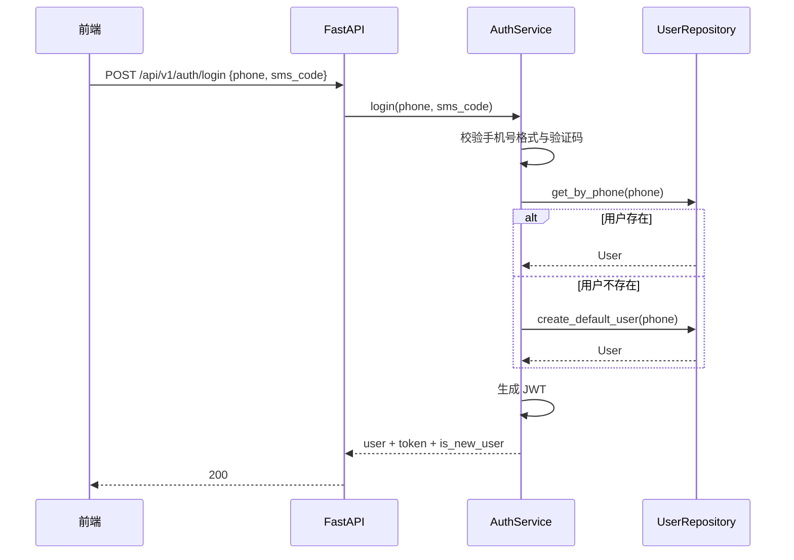

# 设计文档：艾乐学伴 MVP Day 2 — 用户系统与后端核心 CRUD

## 概述

Day 2 的目标是在 Day 1 已完成的项目骨架之上，交付可被前端直接消费的第一批业务接口，覆盖：

- 手机号登录与 JWT 鉴权
- 当前用户信息读取与画像更新
- 学习计划列表、创建、详情、状态更新
- 学习任务列表、详情、状态更新、提交答案
- 知识点列表/详情与题目查询

交付标准遵循 `艾乐学伴MVP(Demo版)-7天冲刺计划.md` 的 Day 2 要求，并参考数据库设计书、OpenAPI 文档、后端微服务设计书与前端设计书，形成一套适合当前单体 FastAPI 工程的 MVP 方案。

## 设计目标

- 复用 Day 1 已有的 SQLAlchemy 模型、数据库脚本、前端 `/api/v1` 访问约定
- 用最少的新增基础设施完成完整鉴权链路与可调试的 Swagger 文档
- 在不修改数据库 DDL 的前提下补齐用户画像与任务详情所需的 API 契约
- 保持 Day 3 AI 对话与任务自动生成能力的扩展空间

## 范围与边界

### 本次实现范围

- `POST /api/v1/auth/login`
- `GET /api/v1/users/me`
- `PUT /api/v1/users/me`
- `GET /api/v1/plans`
- `POST /api/v1/plans`
- `GET /api/v1/plans/{plan_id}`
- `PUT /api/v1/plans/{plan_id}/status`
- `GET /api/v1/tasks`
- `GET /api/v1/tasks/{task_id}`
- `PUT /api/v1/tasks/{task_id}/status`
- `POST /api/v1/tasks/{task_id}/submit-answer`
- `GET /api/v1/knowledge-points`
- `GET /api/v1/knowledge-points/{knowledge_point_id}`
- `GET /api/v1/exercises`

### 明确不在 Day 2 范围内

- 真实短信验证码服务
- Redis 黑名单、刷新 Token、登出接口
- AI 内容生成、求助接口、WebSocket、SSE
- 诊断报告 CRUD
- 前端页面开发与联调脚本

## 文档差异处理

Day 2 计划与现有 OpenAPI/详细设计存在少量差异，统一按以下规则落地：

1. **以 7 天冲刺计划为优先范围**  
   Day 2 只做“用户系统 + 后端核心 CRUD”，因此不会实现 OpenAPI 中更完整的会话、事件、求助等接口。

2. **统一 API 前缀为 `/api/v1`**  
   Day 1 前端 `apiClient` 已固定 `baseURL: /api/v1`，因此 Day 2 所有新接口都挂在该前缀下。

3. **用户更新接口采用 `PUT`，但语义按 MVP 部分更新处理**  
   冲刺计划使用 `PUT /api/users/me`，OpenAPI 使用 `PATCH /users/me`。为避免前端必须回填全部字段，Day 2 的 `PUT` 允许仅提交待变更画像字段。

4. **目标院校映射到 `users.settings`**  
   数据库表 `users` 没有独立的 `target_university` 字段。Day 2 API 在请求/响应层暴露 `target_university`，在持久化层落到 `users.settings.target_university`。

5. **计划接口采用“列表 + 详情”模式**  
   OpenAPI 提供 `GET /plans/current`，Day 2 计划要求 `GET /plans` 与 `GET /plans/{id}`。实现时以当前用户为作用域，列表接口返回全部计划，详情接口返回单计划及任务。

6. **任务状态机先收敛到 3 态**  
   后端详细设计中包含 `skipped`，但 Day 2 冲刺计划只要求 `pending -> in_progress -> completed`。本次接口只接受这 3 个状态，后续如要支持 `skipped` 再扩展。

## 当前代码基线

Day 1 已具备以下基础：

- `backend/app/models/` 下已有 9 个 ORM 模型
- `backend/app/db/session.py` 已配置异步会话
- `backend/app/config.py` 已支持 `JWT_SECRET`
- `frontend/src/services/apiClient.ts` 已自动注入 Bearer Token
- 数据库种子数据已包含 2 个用户、1 个计划、5 个任务、20 个知识点、16 道题

但 Day 2 仍缺少：

- 业务路由与统一 `/api/v1` 路由注册
- JWT 生成与鉴权依赖
- Pydantic Schema
- Repository / Service 实现
- ORM 关系定义与详情查询装载
- 任务判题逻辑与 DTO 组装

## 目标架构

### 目录增量

```text
backend/app/
├── api/
│   ├── auth.py
│   ├── users.py
│   ├── plans.py
│   ├── tasks.py
│   ├── knowledge_points.py
│   └── exercises.py
├── core/
│   ├── auth.py
│   └── exceptions.py
├── dependencies/
│   └── auth.py
├── repositories/
│   ├── user_repository.py
│   ├── plan_repository.py
│   ├── task_repository.py
│   ├── knowledge_point_repository.py
│   └── exercise_repository.py
├── schemas/
│   ├── auth.py
│   ├── users.py
│   ├── plans.py
│   ├── tasks.py
│   ├── knowledge_points.py
│   └── exercises.py
└── services/
    ├── auth_service.py
    ├── user_service.py
    ├── plan_service.py
    ├── task_service.py
    └── learning_resource_service.py
```

### 分层职责

- `api/`：参数绑定、响应返回、异常转换
- `dependencies/`：当前用户提取、鉴权依赖
- `core/`：JWT 工具、通用异常
- `repositories/`：数据库查询与写入
- `services/`：业务规则、状态机、DTO 组装
- `schemas/`：请求体、响应体、枚举定义

## ORM 与数据装载设计

### 关系补充

Day 1 的模型只定义了字段，Day 2 需要补充最关键的关系，便于详情接口与权限判断：

- `User.plans`
- `User.current_plan`
- `LearningPlan.user`
- `LearningPlan.tasks`
- `LearningTask.plan`
- `LearningTask.content_package`

不强制建立 `knowledge_points`、`exercise_items` 的数据库级关系，因为它们通过 JSONB 中的 ID 数组关联。

### JSONB 字段约束

- `User.settings`：至少允许保存 `target_university`
- `LearningTask.knowledge_point_ids`：约定为字符串数组
- `LearningTask.metadata`：至少允许 `estimated_minutes`、`difficulty`、`exercise_ids`
- `ContentPackage.manifest`：Day 2 仅透传，不做生成

### 任务详情组装策略

`GET /api/v1/tasks/{task_id}` 需要同时返回：

- 任务基础信息
- 关联知识点列表
- 关联内容包摘要
- 关联练习题列表

由于 `learning_tasks` 表没有专门的题目关联表，采用两级装载策略：

1. 若 `task.metadata.exercise_ids` 存在，则按该列表精确查询题目
2. 若不存在，则按 `knowledge_point_ids` 反查题库并返回最多 10 道推荐题

这样既兼容当前种子数据，也为 Day 3 自动生成任务时写入 `exercise_ids` 留出扩展位。

## 鉴权设计

### 登录流程



### Mock 验证码规则

- 固定验证码为 `8888`
- 手机号必须满足大陆 11 位数字格式
- 验证失败返回 `400 Bad Request`

### JWT 设计

- 算法：`HS256`
- 载荷字段：
  - `sub`: 用户 ID
  - `phone`: 手机号
  - `exp`: 7 天后过期时间
- 鉴权方式：`Authorization: Bearer <token>`

### 当前用户依赖

鉴权依赖负责：

- 解析 Bearer Token
- 校验签名与过期时间
- 提取 `sub`
- 查询当前用户
- 失败时返回 `401 Unauthorized`

## API 设计

### 1. 认证与用户

#### POST `/api/v1/auth/login`

请求：

```json
{
  "phone": "13800000001",
  "sms_code": "8888"
}
```

响应：

```json
{
  "user": {
    "id": "a0000000-0000-0000-0000-000000000001",
    "phone": "13800000001",
    "nickname": "艾学同学",
    "grade": "高二",
    "textbook_version": "人教版A版",
    "target_university": null,
    "settings": {}
  },
  "token": "jwt",
  "is_new_user": false
}
```

#### GET `/api/v1/users/me`

返回当前用户画像与当前计划摘要：

- `current_plan_id`
- `current_plan_snapshot`: `{ title, status } | null`

#### PUT `/api/v1/users/me`

允许更新：

- `nickname`
- `grade`
- `textbook_version`
- `target_university`
- `settings`

更新规则：

- `phone` 不可修改
- `target_university` 会写入 `settings.target_university`
- 若同时传 `settings.target_university` 与顶层 `target_university`，以后者为准

### 2. 学习计划

#### GET `/api/v1/plans`

返回当前用户全部计划，按以下规则排序：

1. `active`
2. `completed`
3. `archived`
4. 同状态下按 `updated_at` 倒序

#### POST `/api/v1/plans`

创建计划时支持：

- `title`
- `status`，默认 `active`
- `snapshot`
- `set_as_current`，默认 `true`

若新计划设为当前计划，则同步更新 `users.current_plan_id`。

#### GET `/api/v1/plans/{plan_id}`

返回：

- 计划基础字段
- 任务列表
- 任务排序：`in_progress -> pending -> completed`，同状态按 `due_at`、`created_at`

#### PUT `/api/v1/plans/{plan_id}/status`

仅允许更新为：

- `active`
- `completed`
- `archived`

附加规则：

- 用户不能操作非本人计划
- 若计划被置为 `active`，同步更新 `users.current_plan_id`
- 若当前计划被归档，且无其他 `active` 计划，则 `current_plan_id` 置空

### 3. 学习任务

#### GET `/api/v1/tasks`

查询参数：

- `plan_id`：可选，默认取 `users.current_plan_id`
- `status`：可选

返回当前用户指定计划下的任务列表。

#### GET `/api/v1/tasks/{task_id}`

返回：

- `task`
- `knowledge_points`
- `content_package`
- `exercises`

#### PUT `/api/v1/tasks/{task_id}/status`

请求：

```json
{
  "status": "in_progress"
}
```

状态机：

- `pending -> in_progress`：自动写入 `started_at`
- `in_progress -> completed`：自动写入 `completed_at`
- 已完成任务不可重复开始

#### POST `/api/v1/tasks/{task_id}/submit-answer`

请求：

```json
{
  "exercise_id": "ex_func_001",
  "answer": "A"
}
```

响应：

```json
{
  "task_id": "c0000000-0000-0000-0000-000000000003",
  "exercise_id": "ex_func_001",
  "is_correct": true,
  "correct_answer": "A",
  "solution": "选项A中...",
  "task_status": "completed"
}
```

判题规则：

- 仅允许对当前用户可访问的任务提交答案
- 题目必须属于任务关联题目集合
- 对选择题按去空格后字符串精确比对
- 对填空题按去空格后不区分大小写比对
- 首次答对时，若任务状态不是 `completed`，自动推进为 `completed`
- 若任务还是 `pending`，提交答案前自动补 `started_at`

### 4. 知识点与题库

#### GET `/api/v1/knowledge-points`

支持按 `subject` 筛选，默认返回全部数学知识点，按 `id` 升序。

#### GET `/api/v1/knowledge-points/{knowledge_point_id}`

返回：

- 知识点基础信息
- `prerequisites`：先修知识点对象列表

#### GET `/api/v1/exercises`

支持参数：

- `knowledge_point_id`
- `difficulty_min`
- `difficulty_max`
- `limit`

默认按 `difficulty` 升序、`id` 升序返回。

## 异常与响应设计

统一使用 HTTP 状态码表达错误：

- `400 Bad Request`：验证码错误、非法状态流转、请求参数不合法
- `401 Unauthorized`：缺失或无效 Token
- `403 Forbidden`：访问非本人资源
- `404 Not Found`：计划、任务、题目、知识点不存在

FastAPI 默认的 `422` 继续用于请求体校验失败。

错误响应统一为：

```json
{
  "detail": "错误说明"
}
```

## Swagger 与开发体验设计

- 所有 Schema 使用明确字段描述与示例值
- 受保护接口统一接入 `HTTPBearer`
- 在 `/docs` 中可以先调用登录接口复制 Token，再调试剩余接口
- 统一在 `main.py` 注册 `api_v1_router`

## 验证策略

Day 2 不强制一次性补齐完整自动化测试，但至少需要：

- 登录成功/失败手工验证
- 受保护接口未带 Token 返回 401
- 计划详情返回任务排序正确
- 任务状态流转校验正确
- `submit-answer` 能判题并自动完成任务
- 知识点详情能返回先修知识点

如时间允许，优先补 service 层单测，而不是大范围端到端测试。

## 里程碑结果

完成 Day 2 后，系统应具备：

- 一个可登录的最小用户系统
- 一套受 JWT 保护的后端 CRUD API
- 能支撑 Day 4 登录页、计划页、任务页开发的数据接口
- 能支撑 Day 5 做题提交与状态更新的后端基础能力
