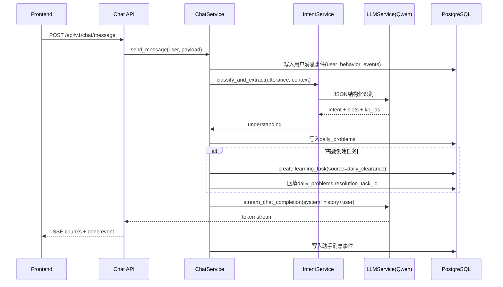

# 设计文档：艾乐学伴 MVP Day 3 — AI 对话引擎与日清旅程后端

## 概述

Day 3 目标是在 Day 2 已有用户、计划、任务 CRUD 的基础上，交付可用的 AI 对话与“日清->任务生成”后端能力，覆盖：

- 统一 LLM 调用层（以千问 `qwen-plus` 为当前底座）
- 日清对话接口（SSE 流式返回）
- 会话历史查询（会话列表 + 消息列表）
- 意图识别与知识点槽位提取
- 自动落库 `daily_problems` 并按规则创建 `learning_tasks`
- 内容包生成接口（`/api/v1/content/generate`）

交付后，API 应能支持示例场景：“我不懂三角函数” -> 识别为概念澄清 -> 写入日清问题 -> 自动创建学习任务。

## 设计目标

- 兼容 Day 1/Day 2 单体 FastAPI 架构，不拆微服务
- 保持数据库主表不扩展，优先复用现有 `daily_problems`、`learning_tasks`、`content_packages`、`user_behavior_events`
- 先实现稳定可演示版本，再为 Day 4 前端对接提供明确契约
- 将模型接入做成可替换 provider 的统一抽象，默认启用 Qwen

## 范围与边界

### 本次实现范围

- `POST /api/v1/chat/message`（SSE）
- `GET /api/v1/chat/sessions`
- `GET /api/v1/chat/sessions/{session_id}/messages`
- `POST /api/v1/content/generate`
- LLM provider 抽象 + Qwen provider 实现
- 意图识别（`CLARIFY_CONCEPT` / `SOLVE_PROBLEM` / `PLAN_REQUEST`）与槽位提取
- 日清问题落库与任务自动创建

### 明确不在 Day 3 范围内

- WebSocket 协议与语音输入输出
- 诊断旅程（上传试卷、报告生成）
- 前端页面改造
- 多模型路由、复杂熔断治理

## 文档对齐与差异处理

1. 7 天计划中命名为 `/api/chat/*`，现工程统一前缀为 `/api/v1`，落地为 `/api/v1/chat/*`。  
2. OpenAPI 二卷存在 `/conversation/utterance` 与 `/daily-clearance/resolutions`，Day 3 MVP 合并为单接口 `POST /api/v1/chat/message`，在一次调用中完成理解、回复、落库与可选任务生成。  
3. 数据库设计未显式提供 `chat_sessions/chat_messages` 表，MVP 复用 `user_behavior_events` 存储消息事件，复用 `daily_problems` 存储结构化“问题理解结果”。

## 当前代码基线

- 已具备 JWT 鉴权、用户/计划/任务/知识点接口
- 已有 `daily_problems`、`learning_tasks`、`content_packages`、`user_behavior_events` ORM 模型
- API 统一路由在 `/api/v1`
- 尚无 LLM 调用层、SSE 输出、会话消息接口

## 目标架构

### 目录增量

```text
backend/app/
├── api/
│   ├── chat.py
│   └── content.py
├── schemas/
│   ├── chat.py
│   └── content.py
├── repositories/
│   ├── daily_problem_repository.py
│   ├── content_package_repository.py
│   └── user_behavior_event_repository.py
├── services/
│   ├── llm/
│   │   ├── base.py
│   │   ├── qwen_provider.py
│   │   └── service.py
│   ├── intent_service.py
│   ├── chat_service.py
│   ├── daily_clearance_service.py
│   └── content_generation_service.py
└── config.py (新增 LLM 配置项)
```

### 分层职责

- `api/`：参数校验、SSE 响应封装、错误映射
- `services/llm/`：统一模型调用，屏蔽 provider 细节
- `intent_service.py`：意图分类、槽位提取、知识点映射
- `daily_clearance_service.py`：写入 `daily_problems`，按规则创建任务
- `chat_service.py`：编排对话上下文、LLM 回复、消息事件持久化
- `repositories/`：新增实体查询和写入封装

## 核心流程设计

### 1) 对话消息（SSE）主流程



### 2) 会话与消息持久化策略

- 会话维度：`user_behavior_events.session_id` 作为 `chat_session_id`
- 消息维度：`event_type in ('utterance_sent','assistant_replied')`
- 消息内容：保存在 `event_data`，结构包含：
  - `role`: `user` / `assistant`
  - `content`: 文本内容
  - `intent`: 仅用户消息可选
  - `knowledge_point_ids`: 仅用户消息可选
  - `created_at`: 冗余字段，便于前端直接展示

### 3) 意图识别策略

- 主意图枚举：`CLARIFY_CONCEPT`、`SOLVE_PROBLEM`、`PLAN_REQUEST`
- 槽位：`concept`、`problem_type`、`goal`、`knowledge_point_ids`
- 先由 LLM 输出 JSON，再做后置规则校验：
  - 枚举非法 -> 回退为 `CLARIFY_CONCEPT`
  - `knowledge_point_ids` 非法或不存在 -> 置空数组
- 无模型可用时使用规则兜底（关键词匹配）

### 4) 自动任务生成规则

- 触发条件：
  - 主意图是 `CLARIFY_CONCEPT` 或 `SOLVE_PROBLEM`
  - 且识别到至少一个 `knowledge_point_id`
- 计划归属：
  - 优先用户 `current_plan_id`
  - 若无当前计划，创建默认 active 计划“日清巩固计划”
- 任务字段：
  - `title`: 基于知识点名模板化生成
  - `type`: `concept_learning`（概念澄清）或 `practice`（解题困难）
  - `status`: `pending`
  - `source`: `daily_clearance`
  - `source_problem_id`: 对应 `daily_problems.id`
  - `metadata.estimated_minutes`: 10~20（按意图映射）

### 5) 内容生成接口规则

- 入参：`knowledge_point_ids`、`style`、`target_minutes`
- 调用 LLM 生成结构化段落，转换为 `content_packages.manifest`
- 输出结构对齐冲刺计划：
  - `sections: [{type: "text"|"example", content: "..."}]`
- 同步写库，默认 `status='ready'`

## LLM 接入设计（Qwen）

### 配置项

在 `config.py` 增加：

- `LLM_PROVIDER`，默认 `qwen`
- `LLM_MODEL`，默认 `qwen-plus`
- `LLM_BASE_URL`，默认 `https://dashscope.aliyuncs.com/compatible-mode/v1`
- `LLM_API_KEY`，本地开发使用提供的 key，推荐放 `.env`，禁止写入仓库
- `LLM_TIMEOUT_SECONDS`，默认 `30`

### Provider 请求约定

- Endpoint: `POST /chat/completions`
- Header: `Authorization: Bearer <LLM_API_KEY>`
- 请求体使用 OpenAI-compatible 格式，支持 `stream: true`
- 流式输出转换为 SSE 事件：`token`、`metadata`、`done`

## API 设计

### POST `/api/v1/chat/message`（SSE）

请求体：

```json
{
  "session_id": "optional-uuid",
  "message": "我不懂三角函数",
  "journey": "DAILY_CLEARANCE"
}
```

SSE 事件：

- `event: token`：逐段回复文本
- `event: metadata`：`intent`、`knowledge_point_ids`、`task_created`
- `event: done`：完整结束包

### GET `/api/v1/chat/sessions`

返回当前用户会话列表（按最近消息时间倒序）：

- `session_id`
- `last_message`
- `last_active_at`
- `message_count`

### GET `/api/v1/chat/sessions/{session_id}/messages`

返回会话全部消息（时间正序）：

- `role`
- `content`
- `created_at`
- `intent`（可选）
- `knowledge_point_ids`（可选）

### POST `/api/v1/content/generate`

请求体：

```json
{
  "knowledge_point_ids": ["kp_trig_sin_def"],
  "style": "encouraging",
  "target_minutes": 8
}
```

响应体：

```json
{
  "content_package_id": "uuid",
  "status": "ready",
  "sections": [
    {"type": "text", "content": "..." },
    {"type": "example", "content": "..."}
  ]
}
```

## 错误与降级设计

- 模型超时/限流：返回友好文案并记录错误日志，不中断接口可用性
- LLM 非流式失败：回退到短答复模板，仍返回 `done`
- 意图识别失败：使用 `CLARIFY_CONCEPT` + 空槽位兜底
- 数据写入失败：终止任务生成，但不影响基础对话回复

## 验证策略（Day 3）

- 手工验证 `POST /api/v1/chat/message` 可流式返回
- 验证“我不懂三角函数”可产出意图与 `daily_problems` 记录
- 验证命中知识点时可自动创建 `learning_tasks`
- 验证会话列表与消息列表可回放
- 验证 `POST /api/v1/content/generate` 可写入并返回 `sections`

## 里程碑结果

完成 Day 3 后，后端具备“可对话 + 可理解 + 可生成任务 + 可生成讲解内容”的最小智能闭环，为 Day 4 前端对话页与 Day 5 闭环联调提供直接支撑。
