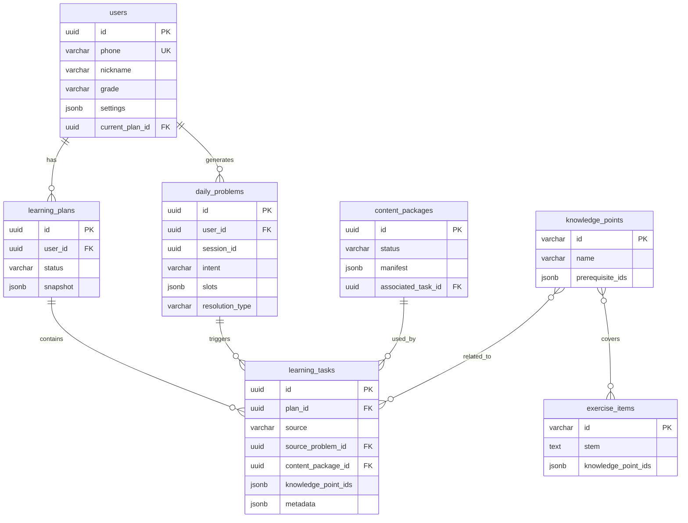

---
# 《艾乐学伴MVP数据库详细设计书 (DDL)》

## 文档版本与修订记录

| 版本 | 日期 | 作者 | 描述 |
| :--- | :--- | :--- | :--- |
| 1.0 | 2026-04-26 | PSL+AI架构师 | 初始版本,定义核心实体与表结构。 |
---
## 1. 引言

### 1.1 目的

本文档旨在为艾乐学伴MVP 1.0提供完整、精确、可直接执行的数据库设计方案。它定义了所有核心业务实体的结构、关系、约束与索引,是后端服务开发、数据持久化及前后端数据契约对齐的唯一权威依据。

### 1.2 设计原则

- **清晰性**:每个字段均有明确的数据类型、约束和业务含义注释。
- **一致性**:命名、数据类型、约束规则在整个数据库中保持一致。
- **可扩展性**:在满足MVP需求的前提下,为关键业务实体预留扩展字段(如 `metadata` JSONB)。
- **性能**:为主键、外键及高频查询条件建立索引。

### 1.3 数据库选型

- **主数据库**:PostgreSQL 15+
- **向量数据库**:Pinecone / Weaviate (用于知识图谱与语义检索,本DDL不包含其Schema)
- **缓存**:Redis (用于会话与热点数据,本DDL不包含)

---

## 2. 核心实体关系图 (ERD)

*(此处省略图表)*
MVP 核心学习闭环涉及 6 张核心业务表,另包含 1 张题库表(`exercise_items`)用于知识点关联示意。实线箭头表示外键引用(1 对多),`*` 表示"多个"。



---

## 3. 表结构详述

### 3.1 表:`users`

存储用户账户、基础画像与当前学习上下文。

| 字段名               | 数据类型    | 空/非空  | 默认值                | 约束/索引                   | 注释与示例                                              |
| :------------------- | :---------- | :------- | :-------------------- | :-------------------------- | :------------------------------------------------------ |
| `id`               | UUID        | NOT NULL | `gen_random_uuid()` | PK                          | 用户唯一标识。示例:`a0eebc99...`                     |
| `phone`            | VARCHAR(20) | NULL     |                       | UNIQUE                      | 用户手机号。允许NULL(兼容其他登录)。示例:13800138000 |
| `avatar_url`       | TEXT        | NULL     |                       |                             | 用户头像的完整URL。                                     |
| `nickname`         | VARCHAR(50) | NOT NULL | `''`                |                             | 用户昵称,界面显示用。示例:艾学同学                    |
| `grade`            | VARCHAR(10) | NOT NULL |                       |                             | 用户年级。枚举值:高一, 高二, 高三。                    |
| `textbook_version` | VARCHAR(50) | NOT NULL | `'人教版A版'`       |                             | 用户使用的数学教材版本。                                |
| `settings`         | JSONB       | NOT NULL | `'{}'::jsonb`       |                             | 用户个性化设置。结构:`{"notification": true}`        |
| `current_plan_id`  | UUID        | NULL     |                       | FK ->`learning_plans(id)` | 用户当前活跃的学习计划ID。同一时间只能有一个。          |
| `created_at`       | TIMESTAMPTZ | NOT NULL | `CURRENT_TIMESTAMP` | INDEX                       | 记录创建时间。                                          |
| `updated_at`       | TIMESTAMPTZ | NOT NULL | `CURRENT_TIMESTAMP` |                             | 记录最后更新时间,由触发器自动更新。                    |

**索引与约束策略:**

- **主键索引**:`id`
- **唯一索引**:`phone` (用于登录和查重)
- **普通索引**:`grade` (用于按年级筛选用户)
- **外键索引**:`current_plan_id` (用于快速关联查询当前计划)
- **外键约束**:`current_plan_id` 引用 `learning_plans(id) ON DELETE SET NULL`。

### 3.2 表:`learning_plans`

存储用户的学习计划。计划是任务的容器,并关联一个特定目标。

| 字段名         | 数据类型     | 空/非空  | 默认值                | 约束/索引          | 注释与示例                                                            |
| :------------- | :----------- | :------- | :-------------------- | :----------------- | :-------------------------------------------------------------------- |
| `id`         | UUID         | NOT NULL | `gen_random_uuid()` | PK                 | 计划唯一标识。                                                        |
| `user_id`    | UUID         | NOT NULL |                       | FK ->`users(id)` | 计划所属用户的ID。                                                    |
| `title`      | VARCHAR(200) | NOT NULL |                       |                    | 计划标题。示例:函数模块巩固计划                                      |
| `status`     | VARCHAR(20)  | NOT NULL | `'active'`          | INDEX              | 枚举值:`active`(进行中), `completed`(已完成), `archived`(归档) |
| `version`    | INTEGER      | NOT NULL | `1`                 |                    | 计划版本号。重新生成时递增。                                          |
| `snapshot`   | JSONB        | NULL     |                       |                    | 计划生成时的完整快照。用于回溯和审计。                                |
| `created_at` | TIMESTAMPTZ  | NOT NULL | `CURRENT_TIMESTAMP` | INDEX              | 记录创建时间。                                                        |
| `updated_at` | TIMESTAMPTZ  | NOT NULL | `CURRENT_TIMESTAMP` |                    | 记录最后更新时间。                                                    |

**索引与约束策略:**

- **主键索引**:`id`
- **外键索引**:`user_id` (用于查询用户的所有计划)
- **复合索引**:`(user_id, status)` (核心查询:查询用户特定状态的计划)
- **普通索引**:`created_at` (用于按时间排序)
- **外键约束**:`user_id` 引用 `users(id) ON DELETE CASCADE`。

### 3.3 表:`learning_tasks`

存储学习计划中的具体任务。任务是系统调度的最小单位,也是用户交互的核心对象。

| 字段名                  | 数据类型     | 空/非空  | 默认值                | 约束/索引                     | 注释与示例                                                            |
| :---------------------- | :----------- | :------- | :-------------------- | :---------------------------- | :-------------------------------------------------------------------- |
| `id`                  | UUID         | NOT NULL | `gen_random_uuid()` | PK                            | 任务唯一标识。                                                        |
| `plan_id`             | UUID         | NOT NULL |                       | FK ->`learning_plans(id)`   | 所属学习计划的ID。                                                    |
| `title`               | VARCHAR(200) | NOT NULL |                       |                               | 任务标题。示例:掌握复合函数单调性判断                                |
| `type`                | VARCHAR(50)  | NOT NULL |                       |                               | 枚举值:`concept_learning`, `practice`, `review`, `diagnosis` |
| `status`              | VARCHAR(20)  | NOT NULL | `'pending'`         | INDEX                         | 枚举值:`pending`, `in_progress`, `completed`, `skipped`      |
| `source`              | VARCHAR(50)  | NOT NULL | `'scheduled'`       | INDEX                         | 枚举值:`scheduled`, `daily_clearance`, `diagnosis`             |
| `source_problem_id`   | UUID         | NULL     |                       | FK ->`daily_problems(id)`   | 日清旅程产生任务的原始问题记录ID。                                    |
| `knowledge_point_ids` | JSONB        | NOT NULL | `'[]'::jsonb`       |                               | 关联的知识点 ID 数组。示例:`["kp_101"]`                            |
| `content_package_id`  | UUID         | NULL     |                       | FK ->`content_packages(id)` | 任务关联的内容包 ID。                                                 |
| `metadata`            | JSONB        | NOT NULL | `'{}'::jsonb`       |                               | 任务元数据,存储难度、预估时长、练习题ID等。                          |
| `due_at`              | TIMESTAMPTZ  | NULL     |                       | INDEX                         | 计划完成时间,用于提醒和排序。                                        |
| `started_at`          | TIMESTAMPTZ  | NULL     |                       |                               | 实际开始时间。                                                        |
| `completed_at`        | TIMESTAMPTZ  | NULL     |                       |                               | 实际完成时间。                                                        |
| `created_at`          | TIMESTAMPTZ  | NOT NULL | `CURRENT_TIMESTAMP` |                               | 记录创建时间。                                                        |

**索引与约束策略:**

- **外键约束**:
  - `plan_id` 引用 `learning_plans(id) ON DELETE CASCADE`
  - `source_problem_id` 引用 `daily_problems(id) ON DELETE SET NULL`
  - `content_package_id` 引用 `content_packages(id) ON DELETE SET NULL`
- **任务状态机规则**:`pending` -> `in_progress` -> `completed`。`skipped` 状态可从前两者直接触发。

---

## 4. 辅助实体表详述(续)

### 4.1 表:`daily_problems`

记录用户在"日清"旅程中提出的每一个学习问题及其全过程。

| 字段名                 | 数据类型     | 空/非空  | 默认值                | 约束/索引                   | 注释与示例                                                        |
| :--------------------- | :----------- | :------- | :-------------------- | :-------------------------- | :---------------------------------------------------------------- |
| `id`                 | UUID         | NOT NULL | `gen_random_uuid()` | PK                          | 问题记录的唯一标识。                                              |
| `user_id`            | UUID         | NOT NULL |                       | FK ->`users(id)`          | 提出问题的用户ID。                                                |
| `session_id`         | UUID         | NOT NULL |                       | INDEX                       | 当日"日清"会话的唯一标识。                                      |
| `original_utterance` | TEXT         | NOT NULL |                       |                             | 用户原始的问题表述(语音转文本后)。                              |
| `clarified_question` | TEXT         | NULL     |                       |                             | 经过对话澄清后的明确问题描述。                                    |
| `intent`             | VARCHAR(100) | NOT NULL |                       | INDEX                       | 系统识别出的问题意图。枚举:`CLARIFY_CONCEPT` 等                |
| `slots`              | JSONB        | NOT NULL | `'{}'::jsonb`       |                             | 意图的结构化槽位。                                                |
| `resolution_type`    | VARCHAR(50)  | NULL     |                       |                             | 解决方式。枚举:`quick_explain`, `practice_task`, `ignored` |
| `resolution_task_id` | UUID         | NULL     |                       | FK ->`learning_tasks(id)` | 指向为解决此问题而创建的学习任务。                                |
| `created_at`         | TIMESTAMPTZ  | NOT NULL | `CURRENT_TIMESTAMP` | INDEX                       | 记录创建时间。                                                    |

### 4.2 表:`content_packages`

存储由AI生成的包含文本、图片、语音等内容的多媒体学习包。

| 字段名                    | 数据类型     | 空/非空  | 默认值                | 约束/索引                   | 注释与示例                                    |
| :------------------------ | :----------- | :------- | :-------------------- | :-------------------------- | :-------------------------------------------- |
| `id`                    | UUID         | NOT NULL | `gen_random_uuid()` | PK                          | 内容包唯一标识。                              |
| `production_job_id`     | VARCHAR(100) | NULL     |                       |                             | 内容生产平台内部的任务 ID。                   |
| `status`                | VARCHAR(20)  | NOT NULL | `'generating'`      | INDEX                       | 枚举值:`generating`, `ready`, `failed` |
| `manifest`              | JSONB        | NOT NULL |                       |                             | 内容清单。描述所有媒体资源及其播放顺序。      |
| `associated_task_id`    | UUID         | NULL     |                       | FK ->`learning_tasks(id)` | 此内容包关联的学习任务 ID。                   |
| `associated_problem_id` | UUID         | NULL     |                       | FK ->`daily_problems(id)` | 此内容包关联的原始问题 ID。                   |
| `created_at`            | TIMESTAMPTZ  | NOT NULL | `CURRENT_TIMESTAMP` |                             | 记录创建时间。                                |
| `updated_at`            | TIMESTAMPTZ  | NOT NULL | `CURRENT_TIMESTAMP` |                             | 记录最后更新时间。                            |

### 4.3 表:`knowledge_points`

存储数学知识点定义,构成简化的知识图谱。

| 字段名               | 数据类型     | 空/非空  | 默认值                | 约束/索引 | 注释与示例                                  |
| :------------------- | :----------- | :------- | :-------------------- | :-------- | :------------------------------------------ |
| `id`               | VARCHAR(50)  | NOT NULL |                       | PK        | 知识点业务ID。示例:`kp_func_def`         |
| `name`             | VARCHAR(200) | NOT NULL |                       |           | 知识点名称。示例:函数的定义与表示          |
| `description`      | TEXT         | NULL     |                       |           | 知识点的详细描述。                          |
| `prerequisite_ids` | JSONB        | NOT NULL | `'[]'::jsonb`       |           | 先修知识点ID数组。示例:`["kp_func_def"]` |
| `difficulty`       | NUMERIC(3,2) | NOT NULL | `0.5`               |           | 难度系数,范围 0~1。                        |
| `subject`          | VARCHAR(20)  | NOT NULL | `'math'`            |           | 所属学科。                                  |
| `created_at`       | TIMESTAMPTZ  | NOT NULL | `CURRENT_TIMESTAMP` |           | 记录创建时间。                              |

---

## 5. 核心业务表设计小结

前述6张表已能支持"用户画像 -> 日清问题 -> 生成任务 -> 执行任务 -> 获得讲解"的完整核心闭环。

---

## 6. 扩展与辅助表详述

### 6.1 表:`diagnosis_reports`

存储用户试卷分析报告。

| 字段名                | 数据类型     | 空/非空  | 默认值                | 约束/索引                   | 注释与示例                          |
| :-------------------- | :----------- | :------- | :-------------------- | :-------------------------- | :---------------------------------- |
| `id`                | UUID         | NOT NULL | `gen_random_uuid()` | PK                          | 诊断报告唯一标识。                  |
| `user_id`           | UUID         | NOT NULL |                       | FK ->`users(id)`          | 用户ID。                            |
| `title`             | VARCHAR(200) | NOT NULL |                       |                             | 报告标题。                          |
| `original_file_url` | TEXT         | NULL     |                       |                             | 原始试卷图片或文件URL。             |
| `summary`           | JSONB        | NOT NULL |                       |                             | 报告核心摘要 (总分, 知识薄弱点等)。 |
| `detailed_analysis` | JSONB        | NOT NULL |                       |                             | 详细的、结构化的题目级分析结果。    |
| `generated_plan_id` | UUID         | NULL     |                       | FK ->`learning_plans(id)` | 基于此报告生成的学习计划 ID。       |
| `created_at`        | TIMESTAMPTZ  | NOT NULL | `CURRENT_TIMESTAMP` | INDEX                       |                                     |

**`detailed_analysis` 结构示例:**

```json
{
  "items": [
    {
      "item_index": 1,
      "user_answer": "A",
      "correct_answer": "B",
      "is_correct": false,
      "knowledge_point_ids": ["kp_101"],
      "error_type": "concept_confusion",
      "ai_commentary": "本题考查了函数定义域的概念..."
    }
  ],
  "knowledge_summary": {
    "kp_101": {"correct_count": 2, "total_count": 3, "mastery": 0.67}
  }
}
```

### 6.2 表:`user_behavior_events`

记录用户前端行为事件,用于分析与AI训练。

| 字段名         | 数据类型     | 空/非空  | 默认值                | 约束/索引          | 注释与示例                                    |
| :------------- | :----------- | :------- | :-------------------- | :----------------- | :-------------------------------------------- |
| `id`         | BIGSERIAL    | NOT NULL |                       | PK                 | 自增主键。                                    |
| `user_id`    | UUID         | NOT NULL |                       | FK ->`users(id)` | 触发事件的用户ID。                            |
| `session_id` | VARCHAR(100) | NOT NULL |                       | INDEX              | 前端会话 ID。                                 |
| `event_type` | VARCHAR(50)  | NOT NULL |                       | INDEX              | 事件类型:`task_start`, `help_request` 等 |
| `event_data` | JSONB        | NOT NULL | `'{}'::jsonb`       |                    | 事件详情。                                    |
| `created_at` | TIMESTAMPTZ  | NOT NULL | `CURRENT_TIMESTAMP` | INDEX              | 服务端接收事件的时间。                        |

### 6.3 表:`exercise_items`

题库中的题目。

| 字段名                  | 数据类型     | 空/非空  | 默认值                | 约束/索引 | 注释与示例                          |
| :---------------------- | :----------- | :------- | :-------------------- | :-------- | :---------------------------------- |
| `id`                  | VARCHAR(50)  | NOT NULL |                       | PK        | 题目唯一ID。示例:`ex_func_def_1` |
| `stem`                | TEXT         | NOT NULL |                       |           | 题干文本,可包含Latex公式。         |
| `options`             | JSONB        | NULL     |                       |           | 选择题的选项数组。                  |
| `correct_answer`      | VARCHAR(500) | NOT NULL |                       |           | 正确答案。                          |
| `solution`            | TEXT         | NULL     |                       |           | 标准解析。                          |
| `knowledge_point_ids` | JSONB        | NOT NULL | `'[]'::jsonb`       |           | 关联知识点。                        |
| `difficulty`          | NUMERIC(3,2) | NOT NULL | `0.5`               |           | 预设难度。                          |
| `metadata`            | JSONB        | NOT NULL | `'{}'::jsonb`       |           | 扩展信息 (如来源、章节等)。         |
| `created_at`          | TIMESTAMPTZ  | NOT NULL | `CURRENT_TIMESTAMP` |           | 记录创建时间。                      |

---

## 7. 数据库视图

为简化常见复杂查询预定义的视图。

### 7.1 视图:`v_user_current_learning_context`

展示用户当前最新的学习上下文。

```sql
CREATE OR REPLACE VIEW v_user_current_learning_context AS
SELECT
    u.id AS user_id,
    u.nickname,
    u.grade,
    p.id AS current_plan_id,
    p.title AS current_plan_title,
    p.status AS plan_status,
    (SELECT COUNT(*) FROM learning_tasks t WHERE t.plan_id = p.id AND t.status = 'pending') AS pending_task_count,
    (SELECT COUNT(*) FROM learning_tasks t WHERE t.plan_id = p.id AND t.status = 'in_progress') AS in_progress_task_count,
    (SELECT json_agg(t) FROM (
        SELECT id, title, status FROM learning_tasks 
        WHERE plan_id = p.id AND status IN ('pending', 'in_progress') 
        ORDER BY due_at NULLS FIRST LIMIT 3
    ) t) AS recent_tasks
FROM users u
LEFT JOIN learning_plans p ON u.current_plan_id = p.id AND p.status = 'active';
```

### 7.2 视图:`v_daily_problems_with_resolution`

展示"日清"问题及其解决状态。

```sql
CREATE OR REPLACE VIEW v_daily_problems_with_resolution AS
SELECT
    dp.*,
    lt.id AS resolved_task_id,
    lt.title AS resolved_task_title,
    lt.status AS resolved_task_status
FROM daily_problems dp
LEFT JOIN learning_tasks lt ON dp.resolution_task_id = lt.id;
```

---

## 8. 初始化数据脚本 (示例)

提供核心表创建及种子数据的SQL脚本框架。

```sql
-- 初始化脚本:aile_mvp_init.sql

-- 1. 启用扩展
CREATE EXTENSION IF NOT EXISTS "uuid-ossp";

-- 2. 表创建 (此处仅以知识点表为例,其余略)
CREATE TABLE knowledge_points (
    id VARCHAR(50) PRIMARY KEY,
    name VARCHAR(200) NOT NULL,
    description TEXT,
    prerequisite_ids JSONB NOT NULL DEFAULT '[]'::jsonb,
    difficulty NUMERIC(3,2) NOT NULL DEFAULT 0.5,
    subject VARCHAR(20) NOT NULL DEFAULT 'math',
    created_at TIMESTAMPTZ NOT NULL DEFAULT CURRENT_TIMESTAMP
);

-- 3. 插入预置知识点 (核心种子数据)
INSERT INTO knowledge_points (id, name, description, prerequisite_ids, difficulty, subject) VALUES
('kp_func_def', '函数的概念与表示', '函数的定义,定义域、值域,函数的三种表示法', '[]', 0.3, 'math'),
('kp_func_mono', '函数的单调性', '增函数、减函数、单调区间的定义与判断', '["kp_func_def"]', 0.5, 'math'),
('kp_comp_func', '复合函数', '复合函数的定义与求法', '["kp_func_def"]', 0.6, 'math'),
('kp_comp_func_mono', '复合函数的单调性', '复合函数单调性的判断法则:"同增异减"', '["kp_func_mono", "kp_comp_func"]', 0.7, 'math')
ON CONFLICT (id) DO NOTHING;

-- 4. 插入预置题目
INSERT INTO exercise_items (id, stem, options, correct_answer, knowledge_point_ids, difficulty) VALUES
('ex_func_def_1', '函数$f(x)=\sqrt{x-1}$的定义域是()', '["A. $(-\\infty, 1]$", "B. $[1, +\\infty)$", "C. $(1, +\\infty)$", "D. $(-\\infty, 1)$"]', 'B', '["kp_func_def"]', 0.3),
('ex_comp_mono_1', '已知函数$f(x)$在区间$[0, +\\infty)$上单调递增,$g(x)=x^2$,则复合函数$h(x)=f(g(x))$在区间$________$上单调递减。', NULL, '$(-\\infty, 0]$', '["kp_comp_func_mono"]', 0.6)
ON CONFLICT (id) DO NOTHING;

-- 5. 创建更新 updated_at 的通用触发器函数
CREATE OR REPLACE FUNCTION update_modified_column()
RETURNS TRIGGER AS $$
BEGIN
    NEW.updated_at = CURRENT_TIMESTAMP;
    RETURN NEW;
END;
$$ LANGUAGE plpgsql;

-- 6. 为表挂载触发器 (示例)
-- CREATE TRIGGER update_users_updated_at BEFORE UPDATE ON users FOR EACH ROW EXECUTE FUNCTION update_modified_column();
```

---

## 9. 总结

《艾乐学伴MVP数据库详细设计书 (DDL)》提供了:

- **核心 6 表**:支撑主业务流程。
- **辅助 3 表**:支持诊断、行为分析、题库。
- **2个视图**:简化复杂查询。
- **初始化脚本**:包含知识点和题目的种子数据。
