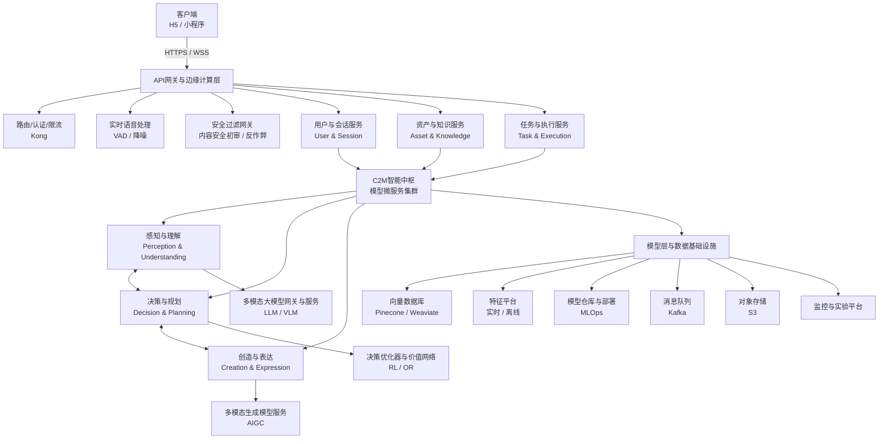
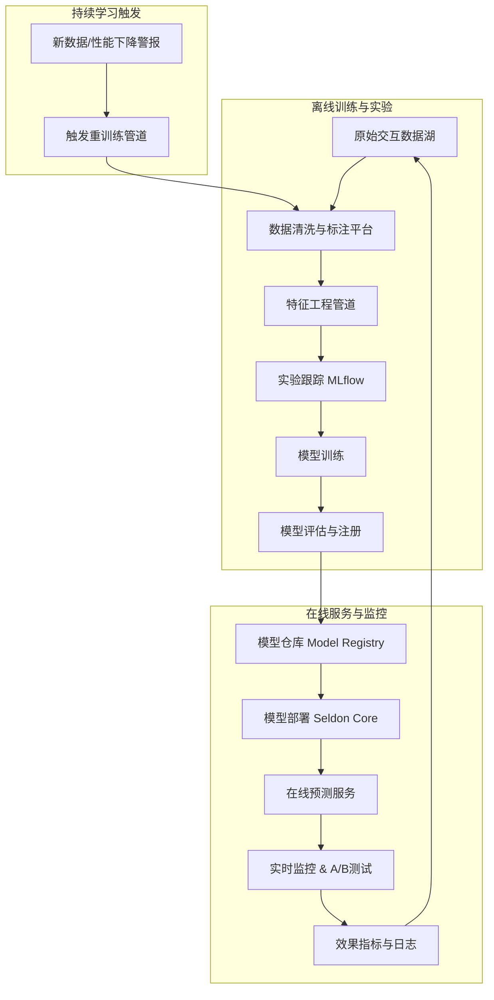

# 艾乐学伴MVP后端与AI开发详细设计文档
# （  先进架构重制版 ）
# 第一部分：系统总览与智能中枢
## 1. 系统架构总览
### 1.1 核心设计哲学

艾乐学伴的后端与AI系统遵循  “感知-决策-创造”一体化智能体架构 。我们摒弃了规则驱动与功能堆砌的传统范式，构建了一个以 多模态大模型为统一认知核心 ，以 领域知识图谱与强化学习为约束与优化器 ，并以数据飞轮为进化引擎的下一代教育服务系统。MVP阶段将完整实现此架构的初级形态，确保系统从诞生之初就具备理解、规划与创造的能力，并为持续自主学习奠定基础。
### 1.2 微服务架构图 (先进架构版)

下图描绘了系统内各服务的职责与数据流，突出了以模型为中心的设计。


### 1.3 技术栈选型 (模型中心化)

| 类别           | 选型                                                                                     | 说明                                                                                                                                                                   |
| ------------------------ | -------------------------------------------------------------------------------------------------- | -------------------------------------------------------------------------------------------------------------------------------------------------------------------------------- |
| API网关        | Kong                                                                                               | 用于流量管理、认证，并集成AI插件（如限流、审计）。                                                                                                                               |
| 微服务框架     | Python (FastAPI) / Go (Gin)                                                             | 后端服务分层选型 ：AI密集型服务（感知、决策、创造）采用 Python (FastAPI) ；高并发基础服务（用户、会话、任务）采用 Go (Gin) 。统一通过API网关暴露。 |
| 模型服务网格   | Seldon Core 或 BentoML                                                         | 用于将AI模型（PyTorch/TensorFlow/Transformer）打包、版本化、部署为高性能API，支持金丝雀发布和自动伸缩。                                                                          |
| 统一大模型网关 | OpenAI API兼容层或LocalAI                                                      | 抽象化底层大模型（GPT-4, Claude, 文心， 通义， 本地模型），提供统一的聊天、补全、嵌入接口，便于切换和降级。                                                                      |
| 向量数据库     | Pinecone (云)/ Qdrant (自托管)                                                 | 用于存储知识、题目、用户画像的向量表示，支撑语义检索与推荐。                                                                                                                     |
| 特征存储       | Feast或Tecton                                                                  | 统一管理实时和离线特征，供各AI模型消费，保证特征一致性。                                                                                                                         |
| 工作流编排     | Prefect或Airflow                                                               | 编排复杂的离线数据处理、模型训练与评估流水线。                                                                                                                                   |
| 监控与实验     | MLflow (实验跟踪) +  Prometheus/Grafana (指标) +  W&B (深度学习实验) | 全链路可观测性与模型生命周期管理。                                                                                                                                               |
## 2. 智能中枢详细设计 (修订版)
### 2.1 感知与理解服务 (Perception & Understanding Service)

本服务是系统的“感官”，负责从多模态用户输入中提取结构化的语义信息和心理状态。

1. 子模块1：混合意图理解引擎
- 输入 ：用户当前话语（文本）、对话历史、当前任务上下文、用户基础画像。
- 架构 ：
  - 大语言模型作为通用理解器 ：将以上信息构建成一个结构化的Prompt，发送给 统一大模型网关 。Prompt要求模型扮演资深教师，并严格以指定JSON格式输出分析结果，包括：intent(意图)、slots(槽位)、confidence(置信度)、sentiment(情感极性)、key_phrases(关键短语)。
  - 领域专项模型作为校验与增强 ：并行调用一个在数学教育语料上 微调过的中型语言模型 （如MathBERT或Qwen-Math），进行意图分类和实体抽取。将其结果与大模型结果进行对比，若差异过大，则触发人工复核流程或降级策略。
  - 知识图谱查询 ：利用从话语中提取的key_phrases，查询知识图谱，获取关联的知识点实体，丰富意图的上下文。
- 输出 ：一个丰富的结构化理解对象，例如：

```json
{
  "intent": "CLARIFY_CONCEPT",
  "slots": {"concept": "composite_function_monotonicity", "aspect": "同增异减法则"},
  "confidence": 0.92,
  "sentiment": "confused",
  "related_knowledge_points": ["kp_101", "kp_102"],
  "next_action_suggestion": "REQUEST_CLARIFICATION"
}
```

2. 子模块2：多模态动机状态预测模型
- 输入 ：用户实时行为事件流（如：答题对错、停留时长、求助频率）、历史交互序列、当前理解结果中的sentiment、语音声学特征（如可用）。
- 架构 ：
  - 特征工程 ：通过特征平台获取用户的历史窗口特征（如过去1小时的正确率趋势）。
  - 时序建模 ：使用一个Transformer Encoder 或 LSTM 网络对行为事件序列进行编码，输出一个状态向量。
  - 多模态融合 ：将时序状态向量、文本情感向量、声学特征向量进行融合。
  - 状态预测 ：通过一个全连接层，预测多维动机状态得分（如：[专注度: 0.7, 挫败感: 0.3, 自信心: 0.6, 兴趣度: 0.5]）。
- 输出 ：一个连续的动机状态向量，而非简单标签。此向量将实时发布到 实时事件总线 ，供其他服务订阅。
### 2.2 决策与规划服务 (Decision & Planning Service)

本服务是系统的“大脑”，基于感知结果，做出如何帮助用户的最佳决策，并生成执行路径。

1. 子模块1：PIOPPE引擎 (基于LLM与强化学习的决策核心)
- 输入 ：当前动机状态向量、用户画像、学习目标、历史干预记录、实时上下文（时间、设备）。
- 架构 ：
  - 动作空间定义 ：定义一组原子干预动作，如：{建议休息， 鼓励， 切换任务， 深度介入交谈， 推荐诊断， ...}。
  - 大语言模型生成候选动作 ：将当前状态输入LLM，要求其生成2-3个最合理的干预动作及简短理由。这利用了LLM的常识和策略生成能力。
  - 价值网络评估 ：一个训练好的深度Q网络或 轻量级价值模型 ，对每个候选动作预测其长期价值（Q值）。价值函数综合考虑预期学习收益、用户潜在负面情绪、习惯养成等多个目标。
  - 决策与探索 ：根据ε-greedy等策略，选择价值最高的动作，或以一定概率探索新动作。决策结果（状态-动作-价值）存入经验回放缓冲区。
- 输出 ：一个具体的干预指令，如：{action: “SUGGEST_BREAK”, params: {duration: 300}, narration: “学了很久了，站起来活动一下怎么样？”}。该指令会通过事件总线触发前端交互。

2. 子模块2：动态规划引擎
- 输入 ：“日清”问题列表、用户知识掌握度向量、动机状态、可用时间约束。
- 架构 ：
  - 大语言模型进行教学策略规划 ：将输入格式化后提交给LLM，要求其输出一个 教学策略草案 ，形式为：“步骤1: 澄清概念A；步骤2: 用例题B演示；步骤3: 变式练习C...”。
  - 知识图谱与资源检索 ：根据策略草案的每一步，从向量数据库中检索最匹配的讲解素材、例题、练习题。这个过程可以建模为一个检索增强生成问题。
  - 组合优化 ：将检索到的资源与策略步骤结合，形成一个包含多个“学习元任务”的草图。然后，用一个 约束优化求解器 （如简单的线性规划或基于规则的优化器）对任务顺序和时长进行微调，以满足总时长、难度递进等约束。
- 输出 ：一个可执行的学习计划，包含任务列表、资源链接、预估路径。
### 2.3 创造与表达服务 (Creation & Expression Service)

本服务是系统的“手”，负责根据决策生成个性化的、多模态的教学内容。

 架构 ：五层级生产平台
- 任务拆解与调度层 ：接收创作请求（如“讲解复合函数求导后符号判断”），将其拆解为原子子任务（文本、公式、图示、语音），并将子任务发布到消息队列的不同主题。
- 多模态生成层 ：
  - 文本生成 ：调用 领域微调的大语言模型 。提示词中会注入详细的上下文：学生卡点、关联知识点、学生认知水平、偏好风格（如“喜欢用体育类比”）。
  - 数学公式与图解 ：使用text-to-LaTeX 模型生成公式，使用 text-to-diagram 模型（如基于扩散模型）生成示意图。MVP阶段图解可简化为动态绘制SVG。
  - 语音合成 ：将生成的文本送入 神经语音合成模型 ，生成带有适当情感和语调的语音。
- 质量与安全合成层 ：所有生成内容流经一个多模态安全模型进行过滤。同时，一个质量评估模型会对生成内容的流畅性、准确性和教学性进行打分，低分内容进入人工复审队列。
- 个性化打包层 ：根据用户画像中的偏好（如“视觉型学习者”），调整内容包中图文和语音的权重与顺序。
- 分发与反馈层 ：将最终内容包存入对象存储，元数据索引至数据库，并通过WebSocket推送。记录用户的播放完成率、“没听懂”反馈等数据，回流至训练集。
# 第二部分：数据、接口与持续学习
## 3. 核心数据模型与存储设计
### 3.1 领域模型 (Domain Model)

以下为核心领域实体及其关系，采用领域驱动设计思想建模。

```yaml
# 用户核心域
User:
  id: UUID
  profile: UserProfile
  learningGoal: LearningGoal
  preference: LearningPreference
  currentMotivationState: Vector # 指向动机状态机的最新输出

UserProfile:
  grade: String
  textbookVersion: String
  baselineAbility: Vector # 初始能力向量
  historicalMetrics: TimeSeriesData # 历史指标（如平均正确率）

LearningGoal:
  target: String # 如“高考数学135分”
  deadline: Timestamp
  subGoals: List[KnowledgeMasteryGoal]

# 学习过程域
LearningSession:
  id: UUID
  userId: UUID
  journeyType: Enum # DAILY_CLEARANCE, EXECUTION, DIAGNOSIS, FREE_CHAT
  startTime: Timestamp
  endTime: Timestamp
  interactionTraces: List[InteractionTrace] # 完整交互轨迹

InteractionTrace:
  userInput: MultiModalInput
  systemUnderstanding: UnderstandingOutput # 感知与理解服务输出
  systemDecision: DecisionOutput # 决策与规划服务输出
  systemAction: ActionOutput # 创造与表达服务输出/前端动作
  userFeedback: Feedback # 显式（评分）与隐式（行为）反馈

# 知识域
KnowledgeGraph:
  nodes:
    - KnowledgePoint:
        id: String
        name: String
        embedding: Vector
        prerequisites: List[KnowledgePoint]
        difficulty: Float
    - Exercise:
        id: String
        stem: String
        embedding: Vector
        solution: StructuredSolution
        metadata: ExerciseMetadata
  edges:
    - tests: (Exercise -> KnowledgePoint) # 题目考查知识点
    - requires: (KnowledgePoint -> KnowledgePoint) # 知识点依赖

# 干预与规划域
LearningPlan:
  id: UUID
  userId: UUID
  version: Integer
  status: Enum
  tasks: List[LearningTask]
  rationale: String # 由规划引擎生成，解释本计划制定的原因

LearningTask:
  id: UUID
  type: Enum
  goal: String
  resources: List[Resource] # 知识点、题目、生成内容包
  estimatedDuration: Integer
  actualOutcome: TaskOutcome
  pedagogicalStrategy: String # 使用的教学策略标签
```
### 3.2 特征存储 (Feature Store) Schema

使用Feast定义核心特征，供各AI模型实时消费。

```yaml
# 实体定义
entities:
  - name: user
    value_type: STRING
    description: "用户ID"
  - name: timestamp
    value_type: UNIX_TIMESTAMP
    description: "事件时间"

# 数据源
fileSources:
  - name: user_behavior_source
    path: /data/user_behavior.parquet
    event_timestamp_column: "timestamp"

# 特征视图定义
featureViews:
  - name: user_realtime_metrics
    entities: [user]
    ttl: 1h
    features:
      - name: rolling_correct_rate_1h
        value_type: FLOAT
      - name: rolling_help_request_frequency_30m
        value_type: FLOAT
      - name: current_motivation_vector
        value_type: FLOAT_VECTOR
    online: true # 启用在线服务
  - name: user_learning_profile
    entities: [user]
    features:
      - name: knowledge_mastery_vector
        value_type: FLOAT_VECTOR
      - name: preferred_learning_modality
        value_type: STRING
    online: true
```
### 3.3 向量数据库 (Vector Database) Schema

使用Pinecone或 Qdrant ，为语义检索服务。

```python
# Pinecone 索引配置
index_config = {
    "name": "aile-knowledge",
    "dimension": 1536,  # 与嵌入模型输出维度一致
    "metric": "cosine",
    "spec": {
        "serverless": {
            "cloud": "aws",
            "region": "us-east-1",
        }
    },
}

# 核心命名空间（Namespaces）规划
# 1. knowledge_points: 存储知识点向量
# 2. exercises: 存储题目题干和解题思路向量
# 3. teaching_materials: 存储教学素材（文本片段、图解描述）向量
# 4. student_problem_patterns: 存储从“日清”中提取的典型学生问题模式向量，用于聚类和相似问题推荐
```
## 4. API接口详规 (智能体服务接口)
### 4.1 统一API网关路由与认证
- 基础路径 : https://api.ailestudy.com/v1
- 认证: 所有请求需在Header中包含 Authorization: Bearer `<JWT>`。JWT由用户服务签发，包含user_id和scope。
- 路由 示例(Kong) :

```nginx
# 感知与理解服务
route /v1/understand -> upstream perception-service

# 决策与规划服务
route /v1/plan -> upstream decision-service

# 内容创造服务(异步)
route /v1/create -> upstream creation-service

# 实时通信
route /v1/realtime -> upstream session-service (WebSocket升级)
```
### 4.2 核心智能体服务接口

1. 接口1: 多模态理解接口

```http
POST /v1/understand

Content-Type: application/json
```
- 请求 体 :

```json
{
  "session_id": "sess_123",
  "modality": "text|audio|image",
  "data": {
    "text": "复合函数单调性不懂",
    "audio_url": "https://.../audio.wav",
    "image_url": "https://.../problem.jpg"
  },
  "context": {
    "journey": "DAILY_CLEARANCE",
    "current_task_id": "task_456",
    "conversation_history": [...],
    "user_motivation_state": [0.7, 0.3, ...]
  }
}
```
- 响应体 :

```json
{
  "request_id": "req_789",
  "understanding": {
    "primary_intent": "CLARIFY_CONCEPT",
    "intents": [
      {"intent": "CLARIFY_CONCEPT", "confidence": 0.92, "slots": {...}},
      {"intent": "REQUEST_EXAMPLE", "confidence": 0.45, "slots": {...}}
    ],
    "extracted_entities": [
      {"type": "KNOWLEDGE_POINT", "id": "kp_101", "confidence": 0.98}
    ],
    "inferred_state": {
      "cognitive_confusion": 0.8,
      "emotional_sentiment": "confused"
    },
    "suggested_actions": ["REQUEST_CLARIFICATION", "PROVIDE_DEFINITION"]
  },
  "metadata": {
    "model_used": "claude-3-sonnet-20240229",
    "processing_time_ms": 320
  }
}
```

2. 接口2: 决策与内容生成接口 (异步)

```http
POST /v1/plan/create

Content-Type: application/json
```
- 请求体 :

```json
{
  "user_id": "user_123",
  "trigger": "DAILY_CLEARANCE_COMPLETE", // *或TASK_HELP_REQUESTED*
  "problems": [...], // *结构化的“日清”问题列表*
  "constraints": {"max_total_duration_minutes": 60}
}
```
- 响应体(202 Accepted) :


```json
{
  "plan_job_id": "job_abc",
  "status_url": "https://api.ailestudy.com/v1/plan/jobs/job_abc",
  "estimated_completion_time": "2023-10-26T10:30:00Z"
}
```

客户端应轮询status_url 或通过WebSocket订阅结果 。最终结果包含完整的LearningPlan和首个ContentPackage。

3. 接口3: 实时通信WebSocket协议
- 连接 URL : wss://api.ailestudy.com/v1/realtime?token=`<JWT>`
- 消息 格式 :

```json
// 客户端 -> 服务端: 语音流片段
{
  "type": "AUDIO_STREAM",
  "session_id": "sess_123",
  "chunk_index": 1,
  "is_final": false,
  "data": "<base64_encoded_audio_chunk>"
}

// 服务端 -> 客户端: 流式AI响应
{
  "type": "AI_RESPONSE_CHUNK",
  "response_id": "resp_xyz",
  "chunk_index": 1,
  "is_final": false,
  "content": {"text": "让我想想...", "audio_url": null}
}

// 服务端 -> 客户端: PIOPPE主动干预
{
  "type": "INTERVENTION",
  "intervention_id": "int_001",
  "action": "SUGGEST_BREAK",
  "parameters": {"duration_s": 300},
  "narration": "连续学习50分钟了，站起来活动一下？",
  "reasoning": "检测到专注度下降趋势，建议短暂休息以维持效率。", // 可解释性
  "options": ["休息5分钟", "继续学习"]
}
```
## 5. 模型训练、部署与持续学习流水线
### 5.1 MLOps基础设施


### 5.2 关键模型训练任务详述
- 动机状态预测模型训练
  - 数据 : 匿名化的用户交互序列，人工标注部分片段的动机状态（作为种子数据）。
  - 架构 : 使用Transformer Encoder处理事件序列，与文本特征融合。
  - 训练 : 自监督预训练（掩码行为预测）+ 监督微调（在种子数据上）。
  - 评估 : 在保留测试集上计算状态预测与人工标注的相关系数。
- PIOPPE价值网络训练(强化学习)
  - 环境 : 将用户学习会话模拟为马尔可夫决策过程。
  - 状态 : 动机状态向量、用户画像、会话上下文。
  - 动作 : 干预动作集合。
  - 奖励 : 人工设计的奖励函数，例如：R = 权重1 * 学习收益 + 权重2 * 用户正反馈 - 权重3 * 干扰惩罚。
  - 算法 : 采用 离线强化学习 (如Conservative Q-Learning)起步，利用历史干预日志（状态-动作-后续状态）训练初始Q网络，避免冷启动风险。后续可接入在线探索。
- 领域教学文本生成模型微调
  - 基础模型 : Qwen-Math或MathGLM。
  - 数据 : 构造高质量的(学生问题上下文, 教师优质回答)配对数据。初期可从教科书、教辅、优秀教师答疑记录中构建。
  - 训练方法 : 指令微调 + 人类反馈强化学习。先SFT，然后收集对模型多个输出的优劣排序，训练一个奖励模型，最后通过PPO进行对齐优化。
### 5.3 部署与发布策略
- 金丝雀发布 : 所有模型更新通过Seldon Core进行金丝雀发布，将小部分流量导向新版本，比较核心指标（如任务完成率、用户满意度）。
- 影子模式 : 对于PIOPPE的新决策策略，可先运行在“影子模式”，即其决策仅记录而不执行，用于评估与旧策略的预期收益差异。
- 快速回滚 : 任何模型在A/B测试中关键指标显著下滑，应在5分钟内自动回滚至上一稳定版本。
# 6. 艾乐学伴MVP设计文档对照检查与修订

经过对《艾乐学伴MVP后端与AI开发详细设计文档 (先进架构重制版)》和《艾乐学伴MVP 1.0 完整产品定义、架构与开发设计说明书 (先进架构对齐终极版)》的交叉审阅，这两份文档共同构成了一个理念先进、设计完整、技术可行的MVP蓝图。然而，在技术实现的细节对齐、术语一致性及部分流程的明确性上，存在一些需要修订的问题，以确保前后端及算法团队在开发时拥有完全一致、无歧义的依据。

以下是发现的问题及具体修订建议，以“ 问题描述-> 修订建议 ”的对照格式列出。
## 一、技术栈与架构表述一致性修订

| 问题位置      | 问题描述                                                                                                                                                                                                 | 修订建议                                                                                                                                                                                                                                             |
| ----------------------- | ------------------------------------------------------------------------------------------------------------------------------------------------------------------------------------------------------------------ | -------------------------------------------------------------------------------------------------------------------------------------------------------------------------------------------------------------------------------------------------------------- |
| 后端文档1.3节 | 技术栈选型表中，微服务框架的描述为：“ Python (FastAPI)  统一AI服务开发栈，利用其异步优势和丰富的AI库生态。Go仅用于超高并发的基础服务。” 此表述可能引起误解，认为所有后端服务均需使用Python。 | 修订为：“后端服务分层选型 ：AI密集型服务（感知、决策、创造）采用  Python (FastAPI) ；高并发基础服务（用户、会话、任务）采用 Go (Gin) 。统一通过API网关暴露。” 并在后续架构描述中明确哪些是“AI微服务”，哪些是“基础微服务”。 |
| 前端文档7.1节 | 技术栈选型中，WebSocket的描述为“原生 WebSocketAPI”，并说明“MVP阶段复杂度可控”。这与后端设计中复杂的消息类型（如CONTENT_GENERATION_UPDATE）可能存在管理复杂度不匹配。                                 | 建议补充说明：“初期使用原生API封装，但需设计统一的连接管理、重连、消息序列化/反序列化层。若复杂度增加，可评估引入 Socket.IO或SignalR。”                                                                                                                      |
## 二、数据模型与接口契约对齐修订

| 问题位置      | 问题描述                                                                                                                                                                                                               | 修订建议                                                                                                                                                                                                       |
| ----------------------- | -------------------------------------------------------------------------------------------------------------------------------------------------------------------------------------------------------------------------------- | ------------------------------------------------------------------------------------------------------------------------------------------------------------------------------------------------------------------------ |
| 前端文档8.1节 | LearningTask接口中定义了contentPackageId?: string;。后端数据库Schema中对应字段名为 content_package_id。命名风格（camelCase vs snake_case）在前后端序列化时需通过ORM或序列化库自动转换，但文档中应作说明。                    | 在前端文档8.1节的LearningTask接口定义后增加注释：“字段命名遵循后端数据库Schema的snake_case约定，由HTTP客户端/服务层进行自动转换。”                                                                           |
| 前端文档8.1节 | DailyProblem接口的resolutionType枚举值为‘quick_explain’和‘practice_task’。后端接口（如 /v1/plan/create ）的请求/响应中未明确定义此枚举 ，可能导致歧义。                                                  | 在后端文档4.2节的“接口2：决策与内容生成接口”的响应体示例中，或在独立的数据字典中，明确定义resolution_type的枚举值，并与前端文档保持一致。                                                |
| 前端/后端文档 | 多处使用journey参数，其枚举值在前端文档2.1节定义为‘DAILY_CLEARANCE’， ‘EXECUTION’， ‘DIAGNOSIS’， ‘FREE_CHAT’。后端文档4.2节的接口示例中使用了相同的值，但风格不统一（有时全大写，有时首字母大写）。 | 统一术语：在所有接口契约和数据类型定义中，明确声明 journey 参数的枚举值列表，并统一使用 全大写蛇形命名 ，如：DAILY_CLEARANCE, TASK_EXECUTION, DIAGNOSIS, FREE_CHAT。在术语表中固化此定义。 |
## 三、核心交互流程与接口定义的明确性修订

| 问题位置      | 问题描述                                                                                                                                                                              | 修订建议                                                                                                                                                                                                                                        |
| ----------------------- | ----------------------------------------------------------------------------------------------------------------------------------------------------------------------------------------------- | --------------------------------------------------------------------------------------------------------------------------------------------------------------------------------------------------------------------------------------------------------- |
| 后端文档4.2节 | 接口2：决策与内容生成接口 被描述为“异步”接口，返回202 Accepted和job_id，客户端需轮询。但前端文档4.4节联调清单中，场景3的描述隐含了同步/推送接收内容包的流程。流程不清晰。 | 明确流程：此接口应为“同步触发+异步推送” 。修订描述为：“该接口同步返回plan_job_id，并立即在响应头或WebSocket连接上开始推送CONTENT_GENERATION_UPDATE和CONTENT_PACKAGE_READY消息。客户端不应依赖轮询，而应监听WebSocket。” |
| 前端文档4.4节 | 联调清单“场景2：旅程一日清”的第四步，后端预期行为包括“成功创建新任务，并返回ID”。但未明确创建任务是调用哪个接口。                                                                 | 在“场景2”的“后端预期响应/行为”栏中补充：“4. 调用 POST /api/v1/learning/tasks接口，成功创建新任务并返回ID。” 使测试场景与接口契约一一对应。                                                                                                          |
| 前端文档5.2节 | 界面J1-B（解决方案确认页）的交互中，用户点击“加入学习计划”后，按钮变为“已加入”。但未描述此时调用哪个后端接口 。                                                                   | 在界面描述“动态行为”部分，明确说明：“用户点击‘加入学习计划’后，前端调用 POST /api/v1/learning/tasks接口（携带任务草稿）。成功后更新按钮状态。”                                                                                                      |
## 四、术语与组件命名一致性修订

| 问题位置      | 问题描述                                                                                                                                                                    | 修订建议                                                                                                                                                                                                                                     |
| ----------------------- | ------------------------------------------------------------------------------------------------------------------------------------------------------------------------------------- | ------------------------------------------------------------------------------------------------------------------------------------------------------------------------------------------------------------------------------------------------------ |
| 两份文档多处  | 对“意图/动机引擎 ”的称呼不统一。后端文档称“感知与理解服务”，其子模块为“混合意图理解引擎”和“多模态动机状态预测模型”。前端文档在流程图中有时简称为“意图/动机引擎”。 | 统一术语：在涉及服务/模块时，统一使用后端文档的定义： 感知与理解服务 （Perception & Understanding Service）。在涉及前端调用或简单描述时，可简述为“意图理解”或“动机状态”，但需在术语表中建立映射关系。                |
| 前端文档3.3节 | 核心组件`<ContentPlayer />`的onNotUnderstand回调。后端WebSocket消息中对应的反馈机制是PIOPPE_INTERVENTION还是另一个专门的反馈接口？未明确。                                | 在后端文档4.3节的WebSocket消息类型中， 新增一种消息类型 ，例如USER_FEEDBACK，用于前端主动上报“没听懂”等行为。或者，在前端文档8.3节明确说明，点击“没听懂”后，调用一个专门的REST反馈接口，例如 POST /api/v1/feedback。 |
## 五、非功能性需求与部署运维的对齐修订

| 问题位置      | 问题描述                                                                                                                                                       | 修订建议                                                                                                                                                                                                            |
| ----------------------- | ------------------------------------------------------------------------------------------------------------------------------------------------------------------------ | ----------------------------------------------------------------------------------------------------------------------------------------------------------------------------------------------------------------------------- |
| 后端文档5.3节 | 提到了“金丝雀发布”、“影子模式”、“快速回滚”等高级部署策略，但前端文档中无相应配合机制描述 。例如，前端如何配合进行A/B测试？影子模式下的用户操作如何记录？ | 在前端文档的全局状态或配置部分，补充说明：“前端应支持从后端动态获取并应用feature flags，以配合A/B测试或金丝雀发布。” 在联调清单中增加一项：“验证前端能正确读取并应用功能开关，上报实验分组信息。”     |
| 前端文档4.4节 | 联调清单“场景7：错误与降级处理”中，要求前端进行“适当重试或降级”。但未定义何种错误应触发重试，何种错误应触发降级（如使用兜底文案） 。                       | 细化场景7的“后端预期响应/行为”和“验证点”。例如：“1. 模拟AI服务超时（504），前端应显示‘学伴思考超时，请稍后再试’，并提示使用预置的例题解析。2. 模拟网络断开，前端应展示离线提示，并在恢复连接后自动重试未成功的请求。” |
## 六、安全与监控的补充修订

| 问题位置      | 问题描述                                                                                                                                 | 修订建议                                                                                                                                                                                                         |
| ----------------------- | -------------------------------------------------------------------------------------------------------------------------------------------------- | -------------------------------------------------------------------------------------------------------------------------------------------------------------------------------------------------------------------------- |
| 后端文档4.1节 | 提到了API网关的认证（JWT），但未定义JWT的标准claims （如user_id, scope的具体值）。也未提及 敏感操作（如删除任务）的额外授权 。 | 在后端文档4.1节增加一个子章节“4.1.1 认证与授权细则”，定义JWT的标准格式、scope的枚举值（如user:read, plan:write），以及各接口所需的权限。                                                                       |
| 两份文档      | 强调了“数据飞轮”和“持续学习”，但未明确用户隐私和数据安全的具体措施 ，特别是在处理未成年人数据和上传的试卷图片时。                    | 在后端文档的“非功能性需求” 部分，或新增“ 安全与合规 ”章节，明确说明：1. 所有用户数据匿名化处理后再用于模型训练。2. 试卷图片的存储与访问加密。3. 提供用户数据导出与删除接口（符合GDPR等合规要求）。 |

 总结 ：以上修订建议主要围绕一致性、明确性和完整性展开。这些问题若不修正，可能在开发联调阶段导致误解、接口对不上、测试场景遗漏等效率损耗。建议您根据此清单，分发至前后端及算法负责人，分别更新对应文档，并组织一次 最终的技术对齐评审会 ，以确保所有细节达成共识。文档本身的质量和先进理念是毋庸置疑的，这些修订是让其从“优秀”变为“可直接执行”的最后一步打磨。

